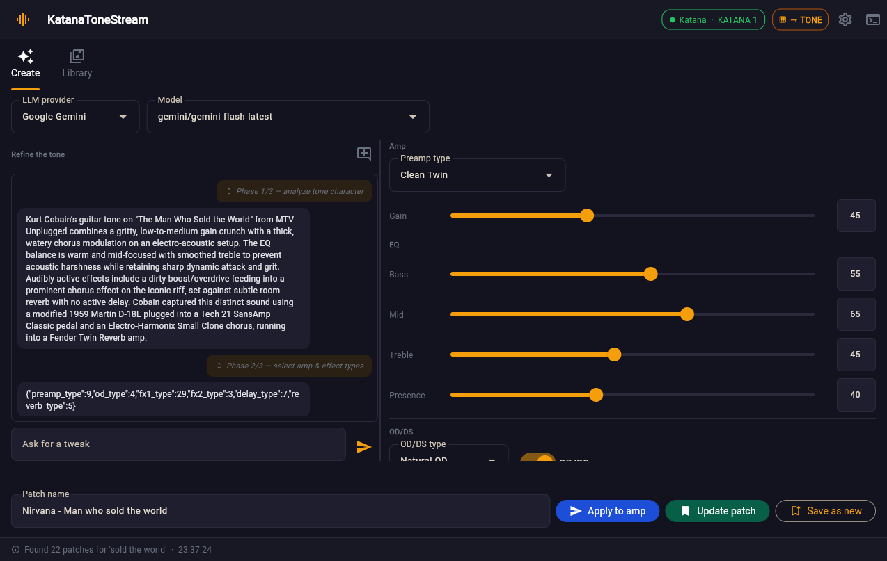
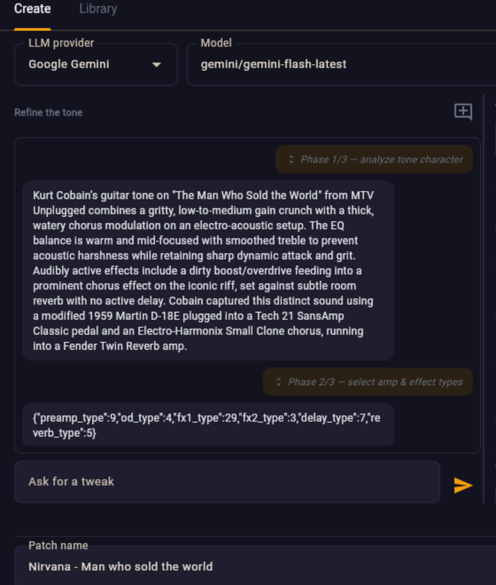

# KatanaToneStream

> ⚠️ **Unofficial software.** KatanaToneStream is **not
> affiliated with Roland Corporation or BOSS** in any
> way.


> **Use this software at your own risk** - This software sends command directly to your amp.
> I tried it on my amp and it didn't do any damage, but I don't guarantee it won't burn yours down.

This is a windows app for the Boss Katna for easier patch management.

It can automatically search for tones in common sites, but more importantly - create and generate tones using
your favorite LLM provider (or locally using ollama).

I don't know how accurate autogenerated tones really are, but it's a fun experiment.

---

**Create tones from conversation** — give it an artist + song , or describe the tone you want and
it walks the conversation through analysis, amp/effect selection, and dial settings, with the
amp controls sitting right next to the chat so you can see the numbers move:



Keep refining in plain English (*"more gain"*, *"add a slapback delay"*) — the whole conversation
stays in view and scrolls with the patch:



## Features

- **Conversational LLM tone generation** — give it an artist + song, or free-chat a description,
  and it dials in a plausible patch; keep refining with follow-up messages.
- **Edit generated patches later** — reopening a saved generated patch resumes its full
  conversation and settings, so you can keep tuning it and overwrite it or save it as a new patch.
- **Search & import patches** from Boss Tone Exchange and guitarpatches.com, in the **Library** tab.
- **Send to amp over USB MIDI** — writes directly to the Katana's live TONE buffer via Roland DT1
  SysEx (reverse-engineered from real Boss Tone Studio captures for interoperability).
- **Local cache** of patches and artwork, so a tone you found once is one click away.

## Requirements

- Windows
- Python **3.13**
- [uv](https://docs.astral.sh/uv/) for dependency management
- A BOSS Katana Mk2 connected by USB (only needed to actually send patches to hardware)

## Install & run

```bash
uv sync                 # install dependencies
uv run python main.py   # launch the app
```

## Configuration

- **Boss Tone Exchange** (optional, only needed to download patches that require login): enter your
  credentials in the app's Settings pane. They are stored in the OS keyring.
- **LLM API keys** (optional, for tone generation): set them in the Settings pane. Keys are stored safely in
  the OS keyring (Windows Credential Manager)
- **Local generation with Ollama**: install the Ollama app, `ollama pull qwen2.5:14b` (a 16 GB GPU
  comfortably runs a 14B model), then pick **Ollama (local)** in the Create tab. No API key needed.

## Development

```bash
uv run pytest                       # run the test suite
uv run ruff check                   # lint
uv run ruff format                  # format
uv run pre-commit run --all-files   # lint + format via .pre-commit-config.yaml
```

See **[AGENTS.md](AGENTS.md)** for architecture, the MIDI protocol details, and the capture toolchain.

## A note on the patch sources

This app fetches patches at runtime from third-party services. It does **not** bundle or redistribute
any patches. You are responsible for complying with the terms of service of any source you query
(Boss Tone Exchange, guitarpatches.com, etc.).

## License

[MIT](LICENSE) © 2026 Arthur Vaiselbuh
